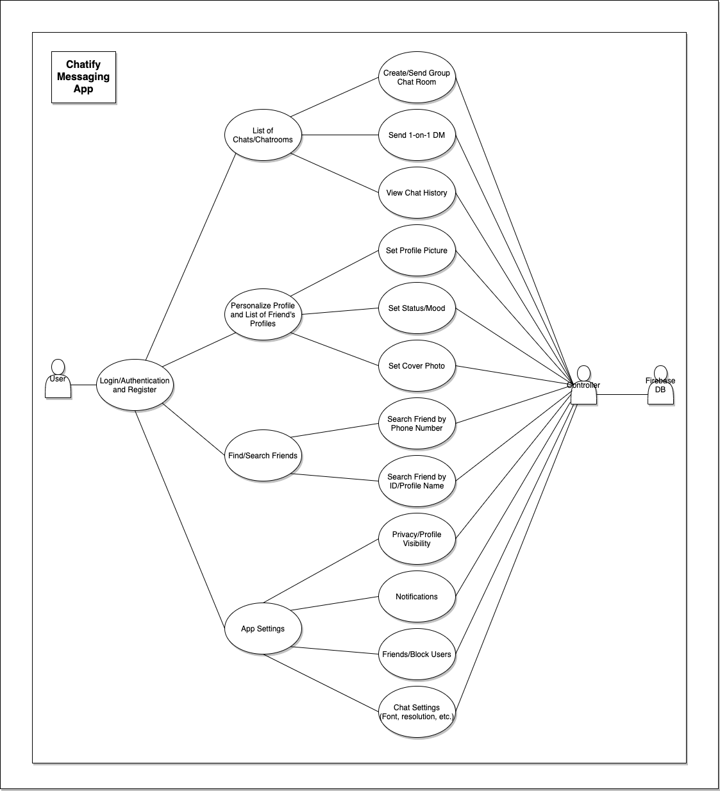

# Chatify Messaging App

A customizable, end-to-end encrypted messaging app that allows users to personalize their profile.

## I. Project Abstract

The overall project that I plan to create is an end-to-end encrypted chat/messaging application that is specialized and only available (downloadable) to those who receive a special authentication code from the user themselves. This chat/messaging app will have features such as individualized and custom chat rooms/groups, 1-on-1 messaging, the ability to set profile pictures and profile information, registration pages, media file transmissions, push notifications, authentication, profile settings, and more. Messages that are sent would be encrypted right on the device, sent to the server, and then unencrypted on the receiving device.

## II. Project Relevance

This project is relevant because it covers a variety of topics that the course introduces over the course of the semester. The first topic this project incorporates is the concept of design patterns. In this case, I plan to follow the MVC (Model View Controller) pattern when building this application. The second topic that is used is the concept of Object-Oriented Design, as this is going to be used to give specific buttons and UI elements their functions. The next topic this project incorporates is graphical user interfaces because the user will need to interact with UI elements in the app to be able to use it. Another topic that is used in this project is database and authentication, because user credentials are added to the database (plan to maybe use firebase instead of creating my own database) and sent messages are added to the database as well. Aside from topics covered in the course, this project will also help students get hands-on with tools such as Version Control (Git and GitHub), testing, and working in small teams.

## III. Conceptual Design

My proposed contribution is to create the application from scratch. Ideally, I would like to make an Android mobile application, but I am open to iOS/cross-platform or even web-based applications as well. I plan to use firebase to store data and user preferences/settings, and I plan to incorporate MVC design patterns to facilitate the transfer and presentation of data between the model and the view using the controller. I also plan to design and implement the UI using Android Studio (but will resort to Flutter if planning to make a cross-platform application). The menus and button functionality will be created in Java and the user interface will be written in Java as well. The Firebase API will be used to store and interact with user data, which will then be pulled from the database and given to the controller to then display to the user on the screen.

## IV. Background

Below is the URL to the GitHub project. It is a basic folder structure/setup for an Android mobile application.

- [https://github.com/AlexK49831/ChatifyMsgApp](https://github.com/AlexK49831/ChatifyMsgApp)

***Building***

To copy the project onto your local machine:

- cd into the appropriate directory
- git clone the repository URL found on this GitHub site

The following software/accounts are required to run the application:

- Android Studio
- Java
- Gradle
- FireBase Account/Authentication

***Running***

To run the application (in development environment/on emulator):

- Open Android Studio
- Open existing Chatify Messaging App project
- Select the play button in the top right of the IDE

The application will either be side-loaded onto a device using Android Studio or launched on the Google Play store to be downloaded and used by non-developers.

## V. Required Resources

Team members must have experience with Java programming, Android Studio IDE, and experience reading API documentation/using API calls. They must also have Android Studio and Java installed on their local machines, along with a Firebase account.
